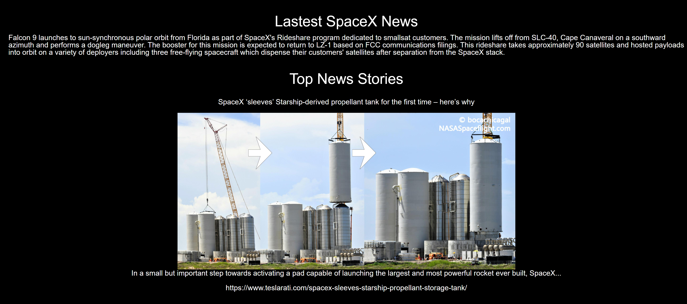

# New Space Times

  ## Description
  An app that requires users login/signup before taking them to the primary News page showing various features related to space including NASA photo of the day and top news stories.
  
  ## Table of Contents
  - [Installation](#Installation)
  
  - [Usage](#Usage)
  
  - [License](#License)
  
  - [Contributing](#Contributing)
  
  - [Test](#Test)
  
  - [Questions](#Questions)
  
  ## Installation
  To install the required dependencies run the following command:
  
      npm i
      
  ## Usage
  Go to live page [Here](https://obscure-tor-43671.herokuapp.com/)
  
  Website Preview:

  
  
  ## License 
  N/A
  
  ## Contributing
  This project was put together by a team of developers. No further contribution needed..
  
  ## Test
  To run test(s), run the following command:
  
      N/A
  
  ## Questions
  If you have any questions or need to contact us directly please email us at:
  <Mary.C.McClernan@gmail.com>
  <ecole052785@gmail.com>
  <Ryan.potere@gmail.com>
  <cbenbow@synergisticagility.com>

  
  If you would like to see some of our other projects feel free to checkout my GitHub at:
  [MCM1015](https://github.com/MCM1015) 
  [ecole7853](https://github.com/ecole7853)
  [Rjpotere](https://github.com/Rjpotere)
  [synag](https://github.com/synag)